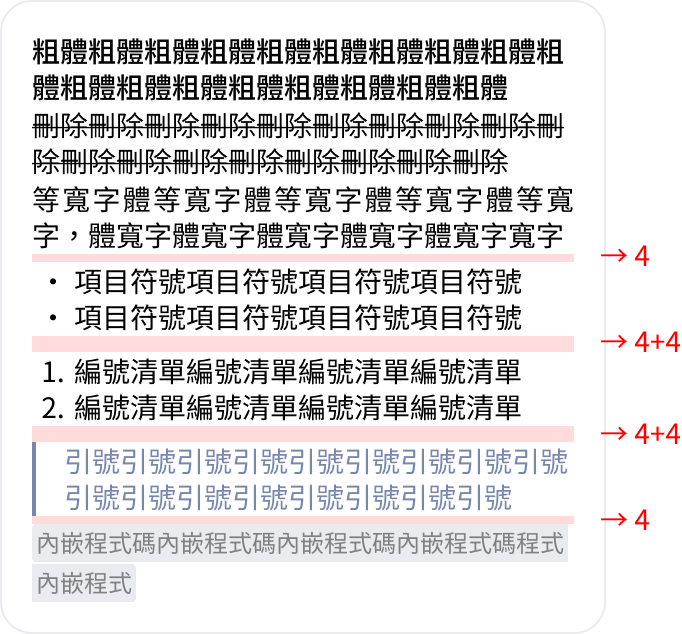
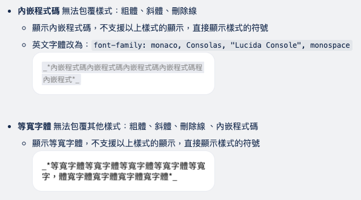

# Sharing 2025.05.22

Juju

---

# 📦 Whatsapp 訊息格式

- [Whatsapp 訊息格式官網文件](https://faq.whatsapp.com/539178204879377/?helpref=uf_share&cms_platform=web)
- 檔案
  - **niffler**: src/components/TemplateMessageModal/whatsappPreview.ts
  - **Asgard**: src/components/messagePreview/whatsappPreview.js
- 使用到的 AI 工具
  - [ChatGPT](https://chat.openai.com/chat)
  - [Windsurf](https://www.windsurfrs.ai/)
  - [Cursor](https://cursor.com/)

---

# 🧱whatsappPreview.ts
```js
export function whatsappTextFormat(text: string, type?: SENDER_TYPE) {
  if (!text) return '';

  /* 處理換行 */
  let formattedText = text.replace(/\n/g, '<br>');
  /* 處理項目符號、數字列表 */
  formattedText = listFormat(formattedText);
  /* 處理不支援交叉樣式的格式 */
  formattedText = unsupportedCrossFormats(formattedText, type);
  /* 處理其他格式規則，但跳過已經被 Monospace 和內嵌程式碼包住的內容 */
  formattedText = otherFormat(formattedText);
  /* 處理引用 */
  formattedText = quoteFormat(formattedText, type);
  /* 移除多餘的 <br> */
  formattedText = formattedText.replace(/<\/ul>\s*<br\s*\/?>(?!\s*$)/gi, '</ul>');
  formattedText = formattedText.replace(/<\/ol>\s*<br\s*\/?>(?!\s*$)/gi, '</ol>');

  return formattedText;
}
```

---

# 🧱whatsappPreview.ts
```js {1,2}
export function whatsappTextFormat(text: string, type?: SENDER_TYPE) {
  if (!text) return '';

  /* 處理換行 */
  let formattedText = text.replace(/\n/g, '<br>');
  /* 處理項目符號、數字列表 */
  formattedText = listFormat(formattedText);
  /* 處理不支援交叉樣式的格式 */
  formattedText = unsupportedCrossFormats(formattedText, type);
  /* 處理其他格式規則，但跳過已經被 Monospace 和內嵌程式碼包住的內容 */
  formattedText = otherFormat(formattedText);
  /* 處理引用 */
  formattedText = quoteFormat(formattedText, type);
  /* 移除多餘的 <br> */
  formattedText = formattedText.replace(/<\/ul>\s*<br\s*\/?>(?!\s*$)/gi, '</ul>');
  formattedText = formattedText.replace(/<\/ol>\s*<br\s*\/?>(?!\s*$)/gi, '</ol>');

  return formattedText;
}
```

---

# 🧱whatsappPreview.ts
```js {1,4-5}
export function whatsappTextFormat(text: string, type?: SENDER_TYPE) {
  if (!text) return '';

  /* 處理換行 */
  let formattedText = text.replace(/\n/g, '<br>');
  /* 處理項目符號、數字列表 */
  formattedText = listFormat(formattedText);
  /* 處理不支援交叉樣式的格式 */
  formattedText = unsupportedCrossFormats(formattedText, type);
  /* 處理其他格式規則，但跳過已經被 Monospace 和內嵌程式碼包住的內容 */
  formattedText = otherFormat(formattedText);
  /* 處理引用 */
  formattedText = quoteFormat(formattedText, type);
  /* 移除多餘的 <br> */
  formattedText = formattedText.replace(/<\/ul>\s*<br\s*\/?>(?!\s*$)/gi, '</ul>');
  formattedText = formattedText.replace(/<\/ol>\s*<br\s*\/?>(?!\s*$)/gi, '</ol>');

  return formattedText;
}
```

---

# 🧱whatsappPreview.ts
```js {1,6-7}
export function whatsappTextFormat(text: string, type?: SENDER_TYPE) {
  if (!text) return '';

  /* 處理換行 */
  let formattedText = text.replace(/\n/g, '<br>');
  /* 處理項目符號、數字列表 */
  formattedText = listFormat(formattedText);
  /* 處理不支援交叉樣式的格式 */
  formattedText = unsupportedCrossFormats(formattedText, type);
  /* 處理其他格式規則，但跳過已經被 Monospace 和內嵌程式碼包住的內容 */
  formattedText = otherFormat(formattedText);
  /* 處理引用 */
  formattedText = quoteFormat(formattedText, type);
  /* 移除多餘的 <br> */
  formattedText = formattedText.replace(/<\/ul>\s*<br\s*\/?>(?!\s*$)/gi, '</ul>');
  formattedText = formattedText.replace(/<\/ol>\s*<br\s*\/?>(?!\s*$)/gi, '</ol>');

  return formattedText;
}
```

---

# listFormat
- 項目符號清單
  - \* 文字
  - \- 文字
- 數字列表
  - 1. 文字
  - 2. 文字

---

# listFormat
項目符號清單
- 拆開每一行 
```js
const processedText = formattedText.split(/\n|<br>/);
```

- 依是否符合條件分組
```js
const listItems = [];
let others = [];

processedText.forEach((item, index) => {
  if (/^[-*]\s/.test(item)) {
    listItems.push({ item, index });
  } else {
    others.push({ item, index });
  }
});
```

---

# listFormat
項目符號清單

- 逐行套 \<li\> 並保留 index 用於後續分組
```js
const liListItems = listItems.map((item) => ({
  index: item.index,
  item: `<li>${item.item.slice(2)}</li>`,
}));
```

---

# listFormat
項目符號清單
- 分組給間隔


---

# listFormat
項目符號清單

- 分組包 \<ul\> & 加上設計的樣式
```js
let ulListItems = [];
for (let i = 0; i < liListItems.length; i++) {
  const current = liListItems[i];
  const lastGroup = ulListItems[ulListItems.length - 1]; // 記錄群組第一筆的 index 和 item

  if (lastGroup && current.index === lastGroup.index + lastGroup.item.length) { // 連續 item
    lastGroup.item.push(current.item); // 存 item
  } else { // 非連續的 item 另開一個 ulListItems 群組
    ulListItems.push({
      index: current.index,
      item: [current.item],
    });
  }
}
/* 組合群組 */
ulListItems = ulListItems.map((item) => ({
  index: item.index,
  item: `<ul style="padding: 4px 0 4px 24px;margin: 0;">${item.item.join('')}</ul>`,
}));
```

---

# listFormat
項目符號清單

- 依照 index 順序組回陣列
```js
let combinedItems = [];
combinedItems = [...others, ...ulListItems].sort((a, b) => a.index - b.index);
```

---

# listFormat
- 項目符號清單
  - \* 文字
  - \- 文字
- 數字列表
  - 1. 文字
  - 2. 文字

---

# listFormat
數字列表
- 依是否符合條件分組
```js
const numberItems = [];
combinedItems.forEach((item) => {
  if (/^\d+\.\s/.test(item.item)) {
    numberItems.push({ item: item.item, index: item.index });
  } else {
    others.push({ item: item.item, index: item.index });
  }
});
```

---

# listFormat
數字列表
- 分組給間隔


---

# listFormat
數字列表

- 逐行套 \<li\> 並保留 index 用於後續分組
```js
const liListItems = numberItems.map((item) => {
  const match = item.item.match(/^(\d+\.\s)(.*)/);
  return {
    index: item.index,
    item: `<li value="${match[1].slice(0, -2)}">${match[2]}</li>`,
  };
});
```

---

# listFormat
數字列表

- 分組包 \<ol\> & 加上設計的樣式
```js
let olListItems = [];
for (let i = 0; i < liListItems.length; i++) {
  const current = liListItems[i];
  const lastGroup = olListItems[olListItems.length - 1]; // 記錄群組第一筆的 index 和 item

  if (lastGroup && current.index === lastGroup.index + lastGroup.item.length) { // 連續 item
    lastGroup.item.push(current.item); // 存 item
  } else { // 非連續的 item 另開一個 ulListItems 群組
    olListItems.push({
      index: current.index,
      item: [current.item],
    });
  }
}
/* 組合群組 */
olListItems = olListItems.map((item) => ({
  index: item.index,
  item: `<ol style="padding: 4px 0 4px 24px;margin: 0;">${item.item.join('')}</ol>`,
}));
```

---

# listFormat
數字列表

- 依照 index 順序組回陣列
```js
combinedItems = [...others, ...olListItems].sort((a, b) => a.index - b.index);
```

---

# 🧱whatsappPreview.ts
```js {1,8-9}
export function whatsappTextFormat(text: string, type?: SENDER_TYPE) {
  if (!text) return '';

  /* 處理換行 */
  let formattedText = text.replace(/\n/g, '<br>');
  /* 處理項目符號、數字列表 */
  formattedText = listFormat(formattedText);
  /* 處理不支援交叉樣式的格式 */
  formattedText = unsupportedCrossFormats(formattedText, type);
  /* 處理其他格式規則，但跳過已經被 Monospace 和內嵌程式碼包住的內容 */
  formattedText = otherFormat(formattedText);
  /* 處理引用 */
  formattedText = quoteFormat(formattedText, type);
  /* 移除多餘的 <br> */
  formattedText = formattedText.replace(/<\/ul>\s*<br\s*\/?>(?!\s*$)/gi, '</ul>');
  formattedText = formattedText.replace(/<\/ol>\s*<br\s*\/?>(?!\s*$)/gi, '</ol>');

  return formattedText;
}
```

---

# unsupportedCrossFormats


---

# unsupportedCrossFormats
先處理等寬字體 Monospace: \```text\```
```js
formattedText = formattedText.replace(
  /```((?:(?!```)[\s\S])*?)```/g,
  '<span style="font-family: monospace;">$1</span>'
);
```

---

# unsupportedCrossFormats
再處理 內嵌程式碼: \`text\`，要排除已經被 Monospace 包住的內容


- 拆開每一行 
```js
let splitText = formattedText.split('<br>');
```

---

# unsupportedCrossFormats
- 逐行套內嵌程式碼樣式
```js
splitText = splitText.map((text) => {
  const result = text.replace(/(?:^|<br>|<li>|\s)`([^\s][^`]*?(?:(?!<br>)[^`])*?[^\s])`(?=\s|<br>|<\/li>|$)/g, (match, content) => {
    // 檢查是否在 Monospace 標籤內
    const startIndex = text.indexOf(match);
    const beforeText = text.substring(0, startIndex);
    const lastMonospaceStart = beforeText.lastIndexOf('<span style="font-family: monospace;">');
    const lastMonospaceEnd = beforeText.lastIndexOf('</span>');

    // 如果在 Monospace 標籤內，則不進行替換
    if (lastMonospaceStart !== -1 && lastMonospaceStart > lastMonospaceEnd) {
      return match;
    }

    // 保留原始的前綴和後綴
    const prefix = match.match(/^(?:<br>|<li>|\s)/)?.[0] || '';
    const suffix = match.match(/(?:\s|<br>|<\/li>|$)$/)?.[0] || '';

    return `${prefix}<code style="background-color: #E9EBF1; color: #808080; padding: 1px 2px; border-radius: 2px; font-size: 12px; line-height: 16.4px; font-family: monaco, Consolas, 'Lucida Console', monospace;">${content}</code>${suffix}`;
  });

  return result;
  });
```

---

# unsupportedCrossFormats
- 組合回字串
```js
formattedText = splitText.join('<br>');
```

---

# 🧱whatsappPreview.ts
```js {1,10-11}
export function whatsappTextFormat(text: string, type?: SENDER_TYPE) {
  if (!text) return '';

  /* 處理換行 */
  let formattedText = text.replace(/\n/g, '<br>');
  /* 處理項目符號、數字列表 */
  formattedText = listFormat(formattedText);
  /* 處理不支援交叉樣式的格式 */
  formattedText = unsupportedCrossFormats(formattedText, type);
  /* 處理其他格式規則，但跳過已經被 Monospace 和內嵌程式碼包住的內容 */
  formattedText = otherFormat(formattedText);
  /* 處理引用 */
  formattedText = quoteFormat(formattedText, type);
  /* 移除多餘的 <br> */
  formattedText = formattedText.replace(/<\/ul>\s*<br\s*\/?>(?!\s*$)/gi, '</ul>');
  formattedText = formattedText.replace(/<\/ol>\s*<br\s*\/?>(?!\s*$)/gi, '</ol>');

  return formattedText;
}
```

---

# otherFormat
- 拆開每一行 
```js
let splitText = formattedText.split('<br>');
```

---

# otherFormat
其他格式規則
```js
const otherFormatRules = [
  /* 斜體: _text_ */
  {},
  /* 粗體: *text* */
  {},
  /* 刪除線: ~text~ */
  {}
];
```

---

# otherFormat
斜體: \_text\_
```js
{
  pattern: /(?:^|<br>|<li>|\s)_([^\s][^_]*?(?:(?!<br>)[^_])*?[^\s])_(?=\s|<br>|<\/li>|$)/g,
  replace: (match, content) => {
    // 保留原始的前綴和後綴
    const prefix = match.match(/^(?:<br>|<li>|\s)/)?.[0] || '';
    const suffix = match.match(/(?:\s|<br>|<\/li>|$)$/)?.[0] || '';

    return `${prefix}<em style="white-space: pre-wrap;">${content}</em>${suffix}`;
  }
}
```

---

# otherFormat
粗體: \*text\*
```js
{
  pattern: /(?:^|<br>|<li>|\s)\*([^\s][^*]*?(?:(?!<br>)[^*])*?[^\s])\*(?=\s|<br>|<\/li>|$)/g,
  replace: (match, content) => {
    // 保留原始的前綴和後綴
    const prefix = match.match(/^(?:<br>|<li>|\s)/)?.[0] || '';
    const suffix = match.match(/(?:\s|<br>|<\/li>|$)$/)?.[0] || '';

    return `${prefix}<strong style="white-space: pre-wrap;">${content}</strong>${suffix}`;
  }
}
```

---

# otherFormat
刪除線: \~text\~
```js
{
  pattern: /(?:^|<br>|<li>|\s)~([^\s][^~]*?(?:(?!<br>)[^~])*?[^\s])~(?=\s|<br>|<\/li>|$)/g,
  replace: (match, content) => {
    // 保留原始的前綴和後綴
    const prefix = match.match(/^(?:<br>|<li>|\s)/)?.[0] || '';
    const suffix = match.match(/(?:\s|<br>|<\/li>|$)$/)?.[0] || '';

    return `${prefix}<del>${content}</del>${suffix}`;
  }
}
```

---

# otherFormat
檢查匹配的內容是否在 Monospace 或內嵌程式碼標籤內
```js
  otherFormatRules.forEach((rule) => {
    splitText = splitText.map((text) => {
      const result = text.replace(rule.pattern, (match, ...args) => {
        // 檢查匹配的內容是否在 Monospace 或內嵌程式碼標籤內
        const startIndex = text.indexOf(match);
        const endIndex = startIndex + match.length;

        // 檢查是否在 <span style="font-family: monospace;"> 或 <code> 標籤內
        const beforeText = text.substring(0, startIndex);
        const afterText = text.substring(endIndex);

        const lastMonospaceStart = beforeText.lastIndexOf('<span style="font-family: monospace;">');
        const endLastMonospaceStart = beforeText.indexOf('</span>');
        const nextMonospaceEnd = afterText.indexOf('</span>');
        const lastCodeStart = beforeText.lastIndexOf('<code');
        const endLastCodeStart = beforeText.lastIndexOf('</code>');
        const nextCodeEnd = afterText.indexOf('</code>');
```
---

# otherFormat
檢查匹配的內容是否在 Monospace 或內嵌程式碼標籤內
```js
        // 如果匹配的內容在 Monospace 或內嵌程式碼標籤內，則不進行替換
        if (
          (lastMonospaceStart !== -1 && (endLastMonospaceStart === -1 || endLastMonospaceStart < lastMonospaceStart) && nextMonospaceEnd !== -1)
          || (lastCodeStart !== -1 && (endLastCodeStart === -1 || endLastCodeStart < lastCodeStart) && nextCodeEnd !== -1)
        ) {
          return match;
        }

        // 否則進行正常的替換
        return rule.replace(match, ...args);
      });
      return result;
    });
    formattedText = splitText.join('<br>');
  });
```

---

# 🧱whatsappPreview.ts
```js {1,12-13}
export function whatsappTextFormat(text: string, type?: SENDER_TYPE) {
  if (!text) return '';

  /* 處理換行 */
  let formattedText = text.replace(/\n/g, '<br>');
  /* 處理項目符號、數字列表 */
  formattedText = listFormat(formattedText);
  /* 處理不支援交叉樣式的格式 */
  formattedText = unsupportedCrossFormats(formattedText, type);
  /* 處理其他格式規則，但跳過已經被 Monospace 和內嵌程式碼包住的內容 */
  formattedText = otherFormat(formattedText);
  /* 處理引用 */
  formattedText = quoteFormat(formattedText, type);
  /* 移除多餘的 <br> */
  formattedText = formattedText.replace(/<\/ul>\s*<br\s*\/?>(?!\s*$)/gi, '</ul>');
  formattedText = formattedText.replace(/<\/ol>\s*<br\s*\/?>(?!\s*$)/gi, '</ol>');

  return formattedText;
}
```

---

# quoteFormat
```js
const quoteLines = formattedText.split('<br>').map((line) => {
  if (line.trim().startsWith('> ')) {
    return `<div style="padding: 4px 0; margin: 0;">
              <div style="padding-left: 16px; border-left: 2px solid #7788AC; color: #7788AC;">
                ${line.replace(/^> /, '')}
              </div>
            </div>`;
  }
  return line;
});
formattedText = quoteLines.join('<br>');

// 移除引號後多餘的 <br>
formattedText = formattedText.replace(/<\/div><br>/g, '</div>');

return formattedText;
```


---

# 🧱whatsappPreview.ts
```js
export function whatsappTextFormat(text: string, type?: SENDER_TYPE) {
  if (!text) return '';

  /* 處理換行 */
  let formattedText = text.replace(/\n/g, '<br>');
  /* 處理項目符號、數字列表 */
  formattedText = listFormat(formattedText);
  /* 處理不支援交叉樣式的格式 */
  formattedText = unsupportedCrossFormats(formattedText, type);
  /* 處理其他格式規則，但跳過已經被 Monospace 和內嵌程式碼包住的內容 */
  formattedText = otherFormat(formattedText);
  /* 處理引用 */
  formattedText = quoteFormat(formattedText, type);
  /* 移除多餘的 <br> */
  formattedText = formattedText.replace(/<\/ul>\s*<br\s*\/?>(?!\s*$)/gi, '</ul>');
  formattedText = formattedText.replace(/<\/ol>\s*<br\s*\/?>(?!\s*$)/gi, '</ol>');

  return formattedText;
}
```
---

完成！
謝謝收聽

---
theme: shibainu
css: unocss
---

<style>
.slidev-code {
  font-size: 10px !important;
}
</style>