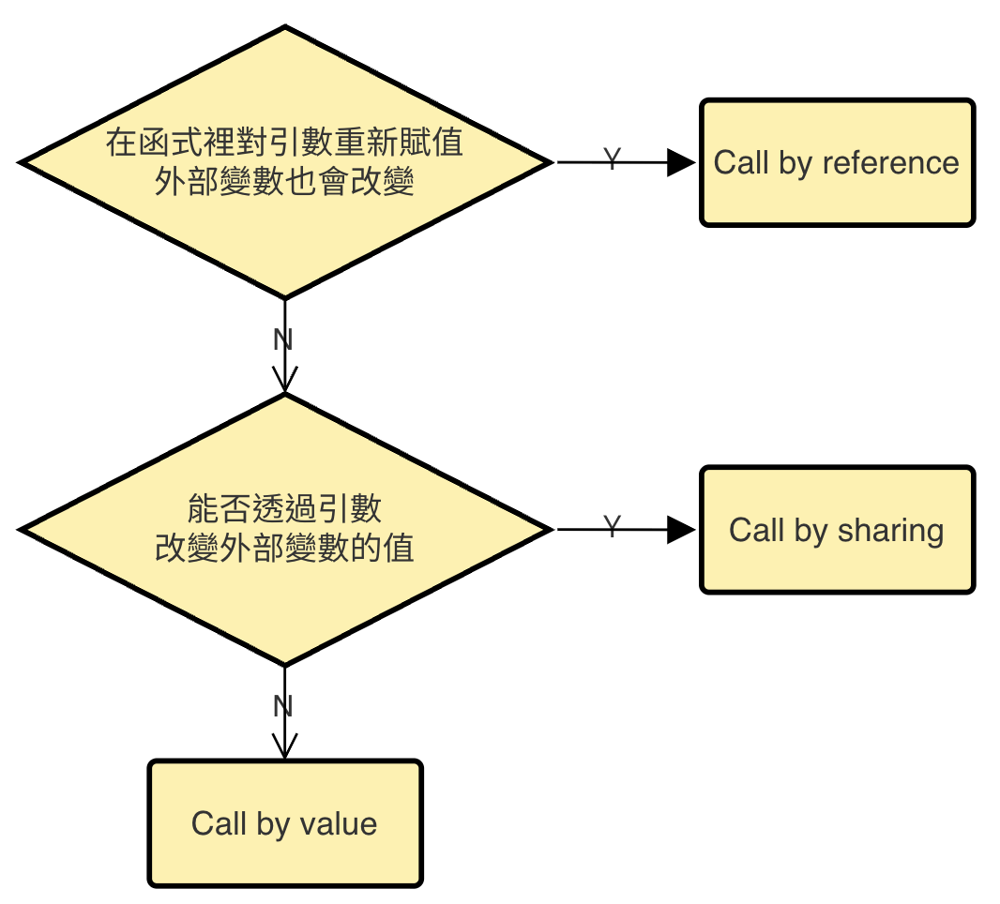

# Sharing 2025.08

Juju

---

# 🪄 探討 JavaScript 的參數傳遞

- [深入探討 JavaScript 中的參數傳遞：call by value 還是 reference？](https://blog.techbridge.cc/2018/06/23/javascript-call-by-value-or-reference/) by Huli
- 程式語言
  - JavaScript
  - Java
  - C
  - C++（真的有 call by reference）
- 總結
---

# 🛠️ JavaScript
- Primitive type 是 call by value（或是 pass by value）
```js
function swap(a, b) {
  var temp = a;
  a = b;
  b = temp;
}
  
var x = 10;
var y = 20;
swap(x, y);
console.log(x, y) // 10, 20
```
- 改變 a 不會改變 x

---

# 🛠️ JavaScript
- Object type 不是 call by value 也不是 call by reference
- Object type 是 call by sharing
```js
function add(obj) {
  obj.number++
}
  
var o = {number: 10}
add(o)
console.log(o.number) // 11
```
```js
function add(obj) {
  // 讓 obj 變成一個新的 object
  obj = {
    number: obj.number + 1
  }
}
  
var o = {number: 10}
add(o)
console.log(o.number) // 10
```

---

# 📌 call by reference & call by sharing

<div class="text-sm mt-2">
來源：
<a href="https://blog.techbridge.cc/2018/06/23/javascript-call-by-value-or-reference/" target="_blank">
深入探討 JavaScript 中的參數傳遞：call by value 還是 reference？
</a>
</div>
<br />

- call by sharing: 「共享」同一個 object

---

# 🧠 call by sharing 其實是 call by value？

<div class="text-sm mt-2">
來源：
<a href="https://blog.techbridge.cc/2018/06/23/javascript-call-by-value-or-reference/" target="_blank">
深入探討 JavaScript 中的參數傳遞：call by value 還是 reference？
</a>
</div>
<br />

- 在底層實作上，其實這個 object 存的是一個記憶體位置
- 其實一樣是傳值的拷貝進去，只是這個值是記憶體位置

---

# 🛠️ Java
- Java 永遠都是 pass by value 已經是共識
- 參考
  - [Is Java “pass-by-reference” or “pass-by-value”?](https://stackoverflow.com/questions/40480/is-java-pass-by-reference-or-pass-by-value)
  - [Java is Pass-by-Value, Dammit!](http://www.javadude.com/articles/passbyvalue.htm)
- Java 中 Call by value，指的是傳遞參數時，一律傳遞變數所儲存的值，無論是基本型態或是類別宣告的型態

---

# 🛠️ C
- C 只有 call by value
- 透過 C 的「指標」儲存記憶體位置，可以在 function 中更改外部變數的值

```c
#include <stdio.h>
  
void swap(int *a, int *b) {
  // 印出 a 跟 b 所存的值
  printf("%ld, %ld", a, b); //0x44, 0x40
  int temp = *b;
  *b = *a;
  *a = temp;
}
  
int main(){
  int x = 10;
  int y = 20;
  // 印出 x 跟 y 的記憶體位置
  printf("%ld %ld\n", &x, &y); // 0x44, 0x40
  swap(&x, &y); // 傳記憶體位置進去
  printf("%d %d\n", x, y); // 20, 10
}
```

---

# 🛠️ C++
- C++ 才是 call by reference
- 操作 a 變數時，就是在操作 x 變數，兩者是一模一樣的
```c++
#include <stdio.h>
  
void swap(int &a, int &b) {
  // 印出 a 跟 b 所存的值與記憶體位置
  printf("%ld, %ld\n", a, b); // 10, 20
  printf("%ld, %ld\n", &a, &b); // 0x44, 0x40
  int temp = b;
  b = a;
  a = temp;
}
  
int main(){
  int x = 10;
  int y = 20;
  
  // 印出 x 跟 y 的記憶體位置
  printf("%ld %ld\n", &x, &y); // 0x44, 0x40
  swap(x, y); // 傳記憶體位置進去
  printf("%d %d\n", x, y); // 20, 10
}
```

---

# 總結 (1/2)


- call by value - 會把傳進去的值複製（無論那個值是數字也好，記憶體位置也好，都會複製一份）
- call by reference - 讓 a 作為 x 的 alias，兩個是同樣的變數

---

# 總結 (2/2)
- 如果你把 pass by reference 理解成像 C++ 那樣子的定義，那 Java 跟 JavaScript 都不會有 pass by reference
- 但如果你把 pass by reference 的「reference」理解成「對於物件的參考」，那 JavaScript 把 object 傳進去，其實就是把「對物件的參考」傳進去，那就可以解釋成是 pass by reference

---

完成！
謝謝收聽

---
theme: shibainu
css: unocss
---

<style>
.slidev-code {
  font-size: 10px !important;
}
</style>