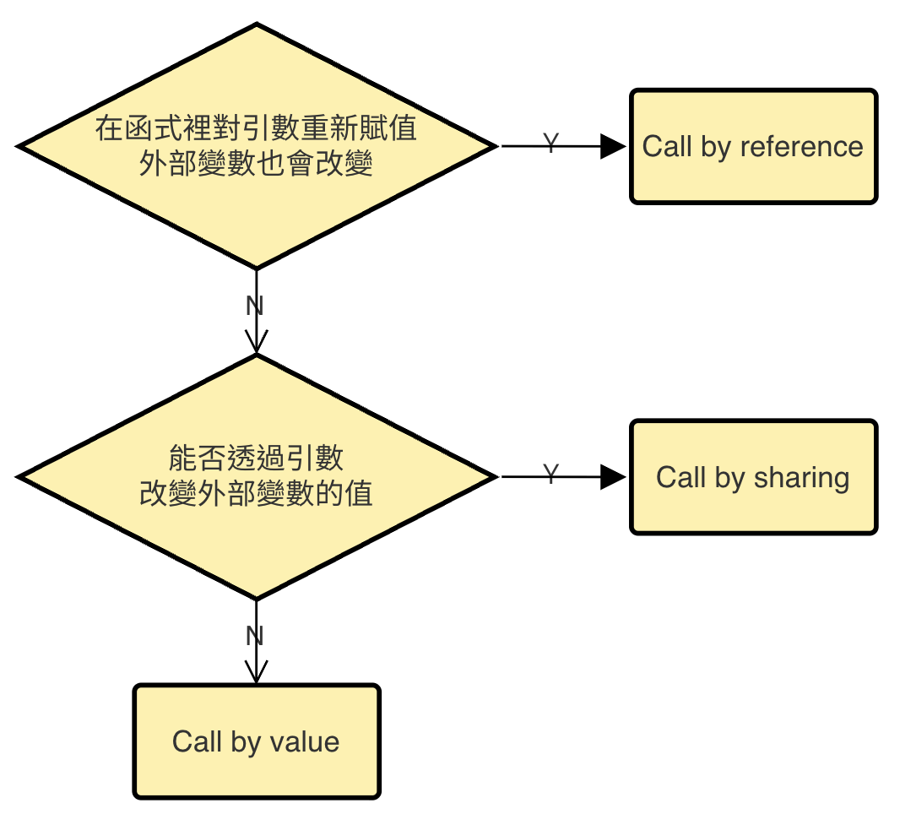

# Sharing 2025.08

Juju

---

# 🪄 探討 JavaScript 的參數傳遞

- [深入探討 JavaScript 中的參數傳遞：call by value 還是 reference？](https://blog.techbridge.cc/2018/06/23/javascript-call-by-value-or-reference/) by Huli
- 程式語言
  - <Link to="javascript" title="JavaScript" />
  - <Link to="java" title="Java" />
  - <Link to="c" title="C" />
  - <Link to="c++" title="C++" />（真的有 call by reference）
- <Link to="summary" title="總結" />

---
routeAlias: javascript
---

# 🛠️ JavaScript
- Primitive type 是 call by value（或是 pass by value）
```js
function swap(a, b) {
  var temp = a;
  a = b;
  b = temp;
}
  
var x = 10;
var y = 20;
swap(x, y);
console.log(x, y) // 10, 20
```

- 在 swap 函數中做的處理不影響 x 跟 y


---

# 🛠️ JavaScript
- Object type 不是 call by value
```js
function add(obj) {
  obj.number++
}
  
var o = {number: 10}
add(o)
console.log(o.number) // 11
```

- Object type 不是 call by value 也不是 call by reference
```js
function add(obj) {
  // 讓 obj 變成一個新的 object
  obj = {
    number: obj.number + 1
  }
}
  
var o = {number: 10}
add(o)
console.log(o.number) // 10
```

- Object type 是 call by sharing

---

# 🧠 call by reference & call by sharing
<div class="flex">
  
  <div class="text-sm mt-2">
    來源：
    <a href="https://blog.techbridge.cc/2018/06/23/javascript-call-by-value-or-reference/" target="_blank">
      深入探討 JavaScript 中的參數傳遞：call by value 還是 reference？
    </a>
  </div>
</div>

<ul>
  <li><span class="font-bold text-xl">call by sharing:</span>「共享」同一個物件，重新賦值就斷開連結</li>
  <li><span class="font-bold text-xl">call by reference:</span> 傳遞記憶體位置（操作 obj 就等於操作 o）</li>
</ul>

---

# 🧠 call by sharing 其實是 call by value？
<div class="flex">
  
  <div class="text-sm mt-2">
    來源：
    <a href="https://blog.techbridge.cc/2018/06/23/javascript-call-by-value-or-reference/" target="_blank">
      深入探討 JavaScript 中的參數傳遞：call by value 還是 reference？
    </a>
  </div>
</div>

- 底層實作上，obj 存的是一個記憶體位置
- 跟 call by value 一樣是傳值的拷貝，只是這個值是記憶體位置

---
routeAlias: java
---

# 🛠️ Java
- Java 只有 pass by value 已經是共識
- 參考
  - [Is Java “pass-by-reference” or “pass-by-value”?](https://stackoverflow.com/questions/40480/is-java-pass-by-reference-or-pass-by-value)
  - [Java is Pass-by-Value, Dammit!](http://www.javadude.com/articles/passbyvalue.htm)
- Java 中 Call by value，指的是傳遞參數時，一律傳遞變數所儲存的值，無論是基本型態（primitive types）或類別型態（class types）

---
routeAlias: c
---

# 🛠️ C
- C 只有 call by value

```c
#include <stdio.h>
  
void swap(int *a, int *b) { // 用指標指向記憶體位置，並操作該記憶體位置
  // 印出 a 跟 b 所存的值
  printf("%ld, %ld", a, b); //0x44, 0x40
  int temp = *b;
  *b = *a;
  *a = temp;
}
  
int main(){
  int x = 10;
  int y = 20;
  // 印出 x 跟 y 的記憶體位置
  printf("%ld %ld\n", &x, &y); // 0x44, 0x40
  swap(&x, &y); // 傳記憶體位置進去
  printf("%d %d\n", x, y); // 20, 10
}
```

- 透過「指標」儲存記憶體位置，可以在 function 中更改外部變數的值

---
routeAlias: c++
---

# 🛠️ C++
- C++ 才有 call by reference
```c++
#include <stdio.h>
  
void swap(int &a, int &b) { // 用 & 直接等於該記憶體位置，並操作該記憶體位置
  // 印出 a 跟 b 所存的值與記憶體位置
  printf("%ld, %ld\n", a, b); // 10, 20
  printf("%ld, %ld\n", &a, &b); // 0x44, 0x40
  int temp = b;
  b = a;
  a = temp;
}
  
int main(){
  int x = 10;
  int y = 20;
  
  // 印出 x 跟 y 的記憶體位置
  printf("%ld %ld\n", &x, &y); // 0x44, 0x40
  swap(x, y);
  printf("%d %d\n", x, y); // 20, 10
}
```

- 操作 a 變數時，就是在操作 x 變數，兩者是一模一樣的

---
routeAlias: summary
---

# 總結 (1/2)

<ul>
  <li><span class="font-bold text-xl">call by reference:</span> 傳遞記憶體位置（操作 obj 就等於操作 o）</li>
  <li><span class="font-bold text-xl">call by sharing:</span>「共享」同一個物件，重新賦值就斷開連結</li>
  <li><span class="font-bold text-xl">call by value:</span> 複製一份傳進去的值</li>
</ul>

---

# 總結 (2/2)
<ul>
  <li>如果你把 pass by reference 理解成像 C++ 那樣子的定義，那 Java 跟 JavaScript 都不會有 pass by reference</li>
  <li>但如果你把 pass by reference 的「reference」理解成「對於物件的參考」，那 JavaScript 把 object 傳進去，其實就是把「對物件的參考」傳進去，那就可以解釋成是 pass by reference</li>
</ul>

<div class="flex mt-4">
  
  <div class="text-sm mt-2">
    來源：
    <a href="https://blog.techbridge.cc/2018/06/23/javascript-call-by-value-or-reference/" target="_blank">
      深入探討 JavaScript 中的參數傳遞：call by value 還是 reference？
    </a>
  </div>
</div>

---

完成！
謝謝收聽

<style>
.slidev-code {
  font-size: 10px !important;
}
</style>
