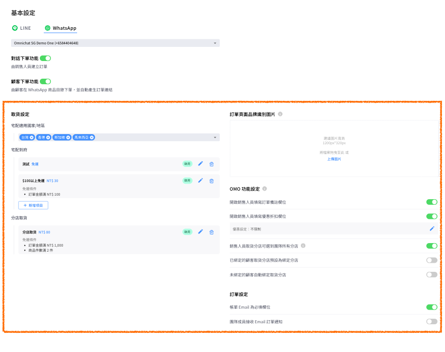
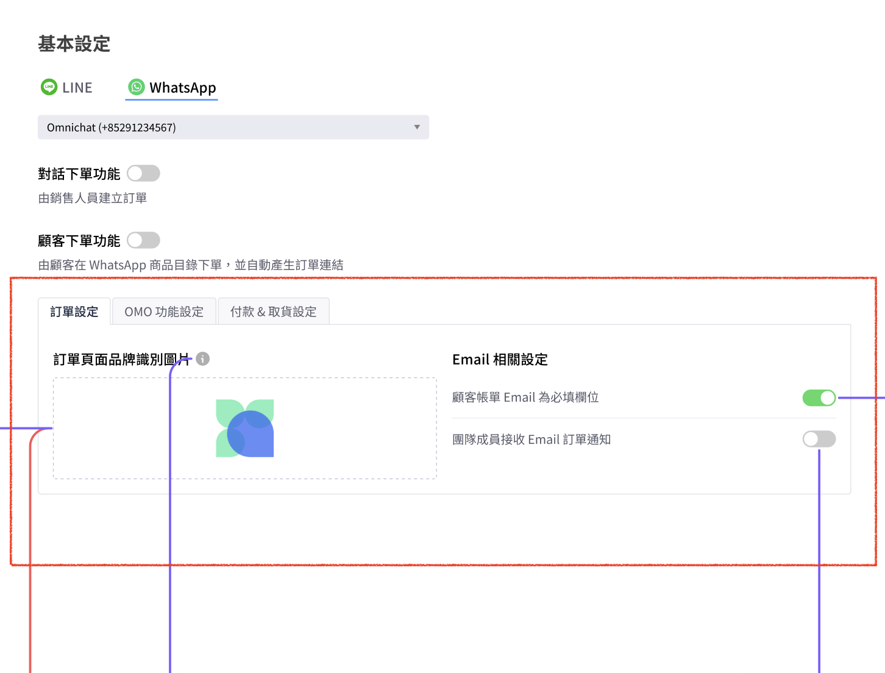
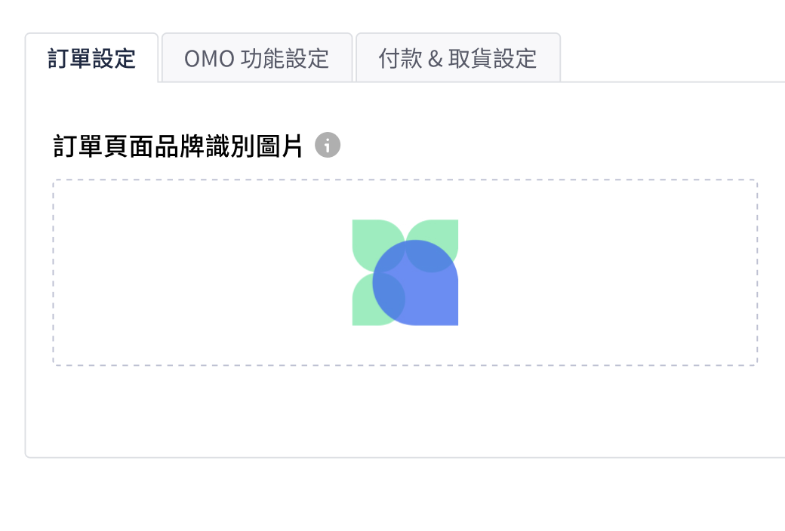
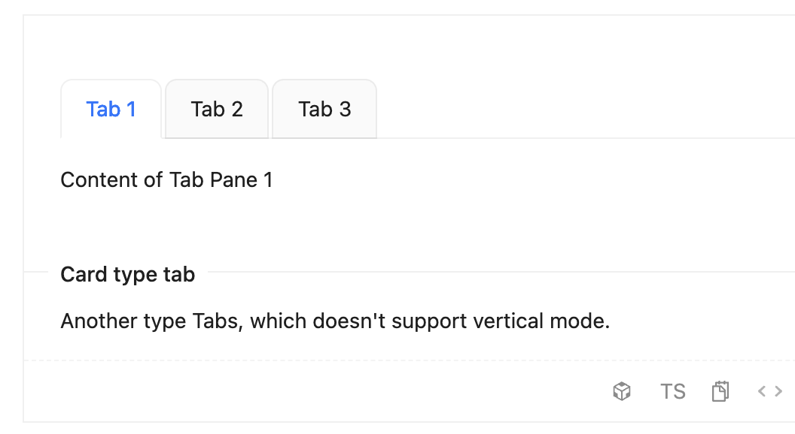
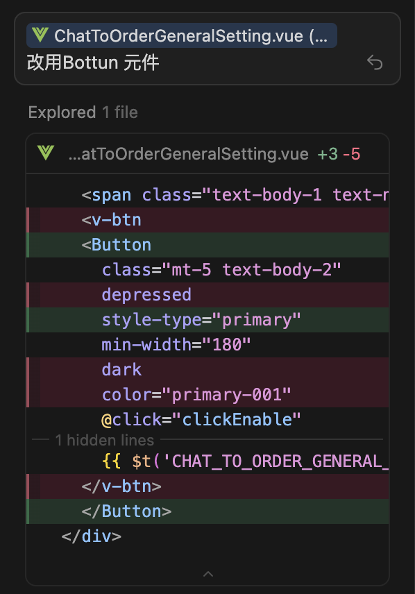
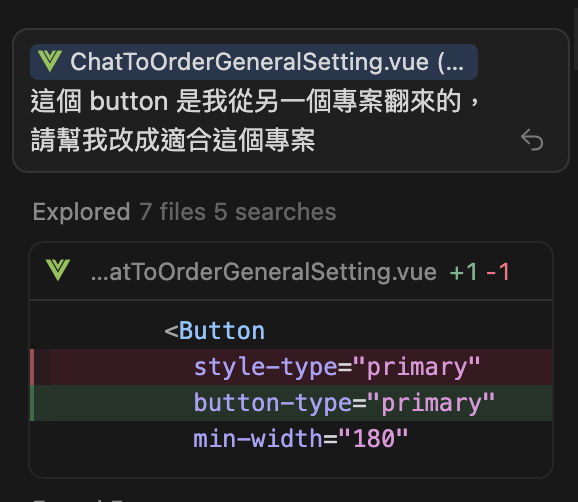
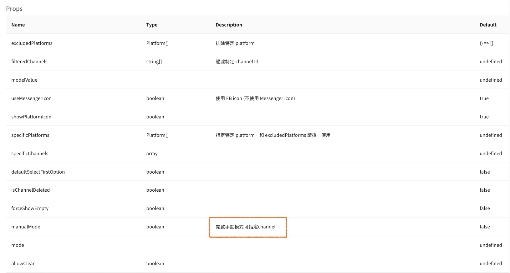
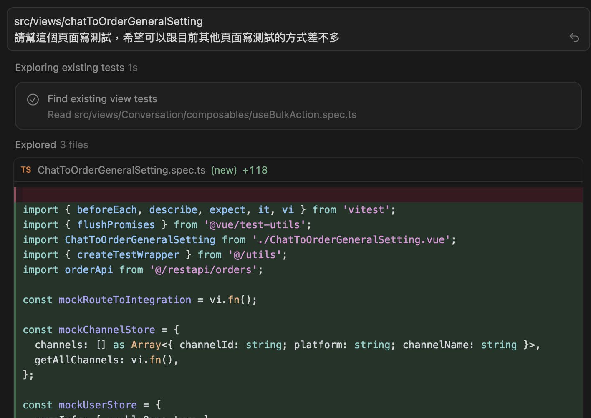

# SHARING 2026.02

Juju

---

# 🪄 Chat to Order 基本設定
加功能 & 重排版 => 適合搬家

- <Link to="ui" title="設計畫面差異" />
- <Link to="ai" title="愚公移山混合 AI 協助" />
- <Link to="guideline" title="共用元件" />
- <Link to="test" title="用 AI 寫測試" />
---
routeAlias: ui
---

# 🎨 設計畫面差異
- 下半部設定區變成 tab 分頁
<div class="flex gap-x-[8px]">
  
  
</div>

---

# 🎨 設計畫面差異
- tab 像 ant-design 的 [Tabs](https://www.antdv.com/components/tabs/#Tabs)
<div class="flex items-start gap-x-[8px]">
  
  
</div>

---
routeAlias: ai
---

# 💪 愚公移山混合 AI 協助
- 一次一個元件或一個區域
- 可能會需要調整元件
<div class="flex items-start gap-x-[8px]">
  
  
</div>

---
routeAlias: guideline
---

# 🛠️ 共用元件
- Design guideline 找元件使用方式
- 有加 props 會自動長出
- 可以另外加描述（ChannelSelector.examples.vue）
```js{6}
const propsDescriptions = ref<PartialPropsKey<Props>>({
  excludedPlatforms: '排除特定 platform',
  specificPlatforms: '指定特定 platform，和 excludedPlatforms 請擇一使用',
  filteredChannels: '過濾特定 channel Id',
  useMessengerIcon: '使用 FB icon (不使用 Messenger icon)',
  manualMode: '開啟手動模式可指定channel',
});
```

---

# 🛠️ 共用元件
<div class="flex">
  
</div>

---
routeAlias: test
---

# ✨ AI 寫測試
- src/components/channelSelect/ChannelSelector.spec.ts
- manualMode: false

```js
  it('does not override selected channel when manualMode is false', async () => {
    const wrapper = createWrapper({
      modelValue: { channelId: 'c1', channelName: 'Line', platform: 'line', oaId: null },
    });
    await flushPromises();

    await wrapper.setProps({
      modelValue: { channelId: 'c2', channelName: 'WA', platform: 'whatsapp', oaId: null },
    });
    await flushPromises();

    const selectProps = wrapper.findComponent({ name: 'Select' }).props('modelValue') as any;
    expect(selectProps.channelId).toBe('c1');
  });
```

---

# ✨ AI 寫測試 - createWrapper
- src/components/channelSelect/ChannelSelector.spec.ts
- manualMode: false

```js{2}
  it('does not override selected channel when manualMode is false', async () => {
    const wrapper = createWrapper({
      modelValue: { channelId: 'c1', channelName: 'Line', platform: 'line', oaId: null },
    });
    [...]
  });
```

- createWrapper 是測試裡的「元件掛載工具」

---

# ✨ AI 寫測試 - createWrapper
- 用 createTestWrapper 去 mount ChannelSelector
- 預先塞好 stub（Select、SvgIcon 等）
- 讓每個測試不用重複寫一堆 mounting 設定
- 只要傳 props 就能建立測試用的 wrapper

```js
const createWrapper = (props = {}) => createTestWrapper(ChannelSelector, props, {}, {
  global: {
    stubs: {
      'Select': SelectStub,
      'SvgIcon': { template: '<div />' },
      'a-select-option': { template: '<div><slot /></div>' },
      'a-tooltip': { template: '<div><slot /></div>' },
    },
  },
});
```

---

# ✨ AI 寫測試

<div class="flex items-center gap-x-6">
  <div class="w-1/3">
    <div class="font-bold text-lg text-center">Stub</div>
    <ul class="mt-2">
      <li>用「替身實作」取代真的東西</li>
      <li>例：把子元件用 <code>&lt;div /&gt;</code> 取代，或把 API 回傳固定資料</li>
      <li>重點是提供簡化行為，讓測試不被外部依賴影響</li>
    </ul>
  </div>
  <div class="w-1/3">
    <div class="font-bold text-lg text-center">Mock</div>
    <ul class="mt-2">
      <li>可驗證的替身</li>
      <li>例：<code>vi.fn()</code> 建立的函式，除了能取代原本實作，還能驗證有沒有被呼叫、被呼叫幾次、帶什麼參數</li>
    </ul>
  </div>
  <div class="w-1/3">
    <div class="font-bold text-lg text-center">Spy</div>
    <ul class="mt-2">
      <li>監聽真實實作</li>
      <li>例：<code>vi.spyOn(obj, 'method')</code>，保留原本行為，但可以觀察呼叫資訊</li>
      <li>重點是監控，不一定要替換</li>
    </ul>
  </div>
</div>

---

# ✨ AI 寫測試
- src/components/channelSelect/ChannelSelector.spec.ts
- manualMode: false

```js{5,10}
  it('does not override selected channel when manualMode is false', async () => {
    const wrapper = createWrapper({
      modelValue: { channelId: 'c1', channelName: 'Line', platform: 'line', oaId: null },
    });
    await flushPromises();

    await wrapper.setProps({
      modelValue: { channelId: 'c2', channelName: 'WA', platform: 'whatsapp', oaId: null },
    });
    await flushPromises();

    const selectProps = wrapper.findComponent({ name: 'Select' }).props('modelValue') as any;
    expect(selectProps.channelId).toBe('c1');
  });
```

---

# ✨ AI 寫測試 - flushPromises()

## 1) 初次建立 wrapper 後
```js
const wrapper = createWrapper(...)
await flushPromises();
```

<ul>
  <li>作用：等待元件初始化時的 watch、computed、以及可能的 async side effects 完成</li>
  <li>原因
    <ul>
      <li>ChannelSelector 會依賴 store 的 channels、計算 filtered list，並在 watch 中同步 selectedChannel</li>
      <li>flushPromises() 可確保 DOM / 狀態都穩定，再做後續操作，避免測試在 state 尚未同步前就驗證，造成 flaky</li>
    </ul>
  </li>
</ul>

---

# ✨ AI 寫測試 - flushPromises()

## 2) setProps 之後
```js
await wrapper.setProps(...)
await flushPromises();
```

<ul>
  <li>作用：等待 props 更新後觸發的 watch(() => props.modelValue, ...) 完成</li>
  <li>原因
    <ul>
      <li>manualMode 的邏輯是在 watch 裡更新 selectedChannel，必須等 watcher 跑完，測試才會拿到正確的 state</li>
    </ul>
  </li>
</ul>

---

# ✨ AI 寫測試
- src/components/channelSelect/ChannelSelector.spec.ts
- manualMode: false

```js
  it('does not override selected channel when manualMode is false', async () => {
    const wrapper = createWrapper({
      modelValue: { channelId: 'c1', channelName: 'Line', platform: 'line', oaId: null },
    });
    await flushPromises();

    await wrapper.setProps({
      modelValue: { channelId: 'c2', channelName: 'WA', platform: 'whatsapp', oaId: null },
    });
    await flushPromises();

    const selectProps = wrapper.findComponent({ name: 'Select' }).props('modelValue') as any;
    expect(selectProps.channelId).toBe('c1');
  });
```

---

# ✨ AI 寫測試
- src/components/channelSelect/ChannelSelector.spec.ts
- manualMode: true

```js
  it('updates selected channel when manualMode is true', async () => {
    const wrapper = createWrapper({
      manualMode: true,
      modelValue: { channelId: 'c1', channelName: 'Line', platform: 'line', oaId: null },
    });
    await flushPromises();

    await wrapper.setProps({
      modelValue: { channelId: 'c2', channelName: 'WA', platform: 'whatsapp', oaId: null },
    });
    await flushPromises();

    const selectProps = wrapper.findComponent({ name: 'Select' }).props('modelValue') as any;
    expect(selectProps.channelId).toBe('c2');
  });
```

---

# ✨ AI 寫測試
- 基本設定
<div class="flex">
  
</div>

---
layout: center
class: text-center
---

<div class="text-6xl font-bold">結束</div>
<div class="text-3xl mt-6">謝謝收聽</div>

<style>
.slidev-code {
  font-size: 10px !important;
}
.slidev-page-number {
  display: block !important;
  position: fixed;
  right: 0;
  bottom: 0;
  font-size: 12px;
  opacity: 0.6;
}
</style>
